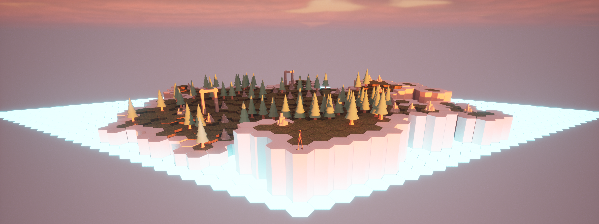

## _Federation_ is coming next year to Windows & MacOS!

### Wishlist on:

<a href="https://store.steampowered.com/app/2298940/Federation/" target="_blank"><kbd>      Steam   </kbd></a> &nbsp;
<a href="https://store.epicgames.com/en-US/p/federation-3b45c0" target="_blank"><kbd>      Epic Games   </kbd></a>

 

 

<em>Federation</em> is a third-person time-manipulation production puzzler.

Playing as a recently-demoted low-level manager in a new department, you're tasked with exploring new islands claimed by your company and making them useful. How you do that is completely up to you.

<ul>
    <li>Claim, explore, and connect islands across time, supported by your company's vast treasury of captured worlds.</li>
    <li>Discover and use what was left behind to build a growing production network tailored to your desires.</li>
    <li>Hire reports to delegate and automate every task.</li>
    <li>Build and decorate in 3D using increasingly powerful build tools. As you progress, you'll terraform islands and bend time to your will.</li>
    <li>Nominate yourself for Performance Review puzzles to get promoted and build your way up the corporate ladder.</li>
</ul>

